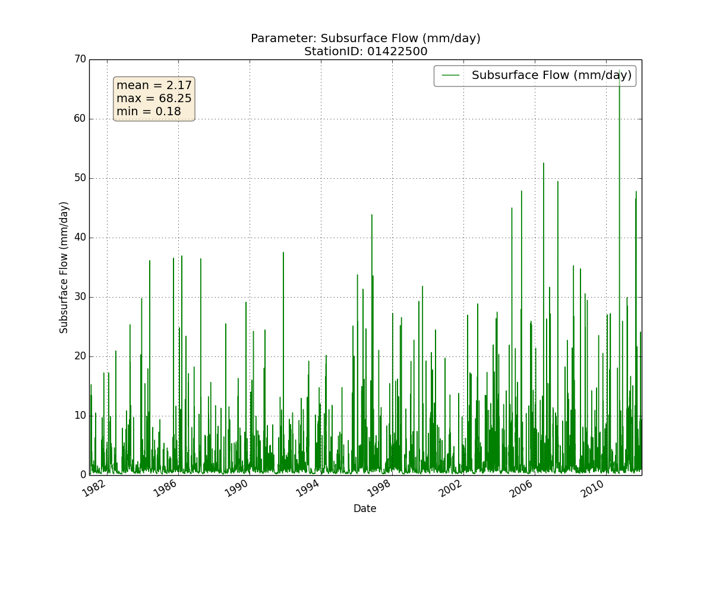

waterapputils
=============

Contents
--------

[Version](#version)

[Author](#author)

[Description](#description)

[*waterapputils* Command Line Interface](#waterapputils-command-line-interface)

[*waterapputils* Simple UML Diagram](#waterapputils-simple-uml-diagram)

[Sample Images](#sample-images)

[General Instructions](#general-instructions)

[Testing](#testing)

[Code Documentation](#code-documentation)

[Requirements](#requirements)

[Installation Instructions](#installation-instructions)

[Repository Layout](#repository-layout)

[In the Works](#in-the-works)

[Disclaimer and Notice](#disclaimer-and-notice)

Version
-------

1.0.0

Author
------

	Jeremiah Lant
	Hydrologist 
	U.S. Geological Survey
	Kentucky Water Science Center
	Louisville, Kentucky 40299
	(502) 493-1949
	jlant@ugs.gov
	
Description
-----------	
*waterapputils* is a command line tool for analysing, processing, and editing output data files from the
USGS Kentucky Water Science Center WATER application developed by Williamson, T., Ulery, R. and Newson, J., 2012.
WATER is a graphical user interface wrapped around a variant of the rainfall-runoff model called Topmodel 
(Topography based hydrological model) by Keith Beven, Lancaster University. The model estimates river discharge 
and spatial soil water saturation patterns for a particular catchment basin using topographic, climatic, and geological 
input data parameters.

Some sample highlights include:

* Processes WATER output *.txt data files 
* Processes WATER output *.xml data files that store information about a particular model run 
* Creates an edited/updated *.xml data file that WATER can read 
* Generates and saves plots of all parameters found in WATER output *.txt data files
* Generates and saves plots of time-series parameters found in WATER output *.xml data files
* Generates and saves comparison plots between original and editted *.xml data files
* Unix friendly

*waterapputils* can read, process, plot, and print data and information from WATER output *.txt  and *.xml data files.
The *.txt data files contain the following output parameters from the WATER application:

* discharge (cfs)
* subsurface flow (mm/day)
* impervious flow (mm/day)
* infiltration excess (mm/day)
* initial abstracted flow (mm/day)
* overland flow (mm/day)
* potential evapotranspiration, pet, (mm/day)
* actual evapotranspiration, aet, (mm/day)
* average soil root zone (mm)
* average soil unsaturated zone (mm)
* snow pack (mm)
* precipitation (mm/day)
* storage deficit (mm/day)
* return flow (mm/day)

Time-series plots for processed *.txt are automatically created and saved for all parameters displaying relevant statistics 
(mean, maximum, and minimum) with detailed axes and title descriptions.  For sample images, please see [Sample Images](#sample-images).

The *.xml data files contain the following parameters about a particular model run (simulation) for each region type (forest,
unallocated, and agricultural):

* simulation features - data regarding particular basin features and model coefficients; see below for list of features
* simulation topographic wetness index - topographic wetness index (twi) data
* study unit discharge series - time-series of calculated discharge
* climatic precipitation series - time-series of input precipitation 
* climatic temperature series - time-series of input temperature

The following is a list of simulation features:

* Study Unit Total Area
* Total Estimated Stream Area
* Total Lake Area
* Lake Decay
* Uplake Area
* Ground Water Withdrawal
* Surface Water Withdrawal
* Surface Water Discharge
* Latitude
* Conductivity Multiplier
* Water Holding Capacity
* Wettness Index Adjustment
* Soil Depth
* Percent Macropore
* Field Capacity
* Saturated Hydraulic Conductivity
* Porosity
* Depth of Root Zone
* Scaling Factor M
* Spatial Coefficient
* Percent Impervious
* Percent Road Impervious
* Effective Impervious
* Impervious Runoff Delay
* Evapotranspiration Exponent
* Snow Melt Coefficient
* Rain on Snow Melt Coefficient
* Impervious Curve Number

*waterapputils* is written in Python and has been built to be a "Unix friendly" tool, meaning it can be placed anywhere 
along a Unix pipeline when analyzing a single output *.txt or *.xml file. *waterapputils* has a help menu that lists the 
current command line arguments/options that can be assed to *waterapputils*. At this time, users can run *waterapputils*
using a shell with the appropriate flags to analyse and process WATER output files.  
Please see [General Instructions](#general-instructions) for details on how to use waterapputils. 

Return to [Contents](#contents).

*waterapputils* Command Line Interface
-------------------------------

*waterapputils* Simple UML Diagram
-------------------------------

Sample Images
-------------

Return to [Contents](#contents).

General Instructions
--------------------

To use *waterapputils*, users will use a shell to execute *waterapputils* with the appropriate flags to process files 
generated by the WATER application.  Plots are automatically generated and saved to an directory named *output-filename*. 

**Help -h flag**

The -h flag spawns a help menu with all the flag options.

**File(s) -txt flag**

The -txt flag specifies an WATER output *.txt file or files to process.

To process a single WATER output *.txt data file the general syntax is:

	$ python waterapputils.py -txt path/to/file
	
The above commands will create an output directory with the following contents:

	output-filename/
					*.png		# plots of each parameter in the data file
					...
					*.png			
					
For example, using data contained in this repository's data directory:

	$ python waterapputils.py -txt ../data/txt-datafiles/2013-10-29_12.50.47_WATER.txt
	
will produce the following output directory with plots of each parameter with the *StationID* prefix: 

	output-2013-10-29_12.50.47_WATER/
					2013-29-10_b - AET.png	
					2013-29-10_b - Average Soil Root zone.png
					...
					2013-29-10_b - Subsurface Flow.png

					
To process a multiple WATER output *.txt files the general command syntax is:

	$ python waterapputils.py -txt file1 file2 file3

**File(s) -xml flag**

The -xml flag specifies an WATER output *.xml file or files to process.

To process a single WATER output *.xml data file the general syntax is:

	$ python waterapputils.py -xml path/to/file
	
The above commands will create an output directory with the following contents:

	output-filename/
					*.png		# plots of each parameter in the data file
					...
					*.png			
					
For example, using data contained in this repository's data directory:

	$ python waterapputils.py -xml ../data/xml-datafiles/2013-10-29_12.14.20_WATERSimulation.xml
	
will produce the following output directory with plots of each parameter with the *ProjName* prefix (same as *StationID* in *.txt file): 

	2013-10-29_12.14.20_WATERSimulation/
					2013-29-10_b - regiontype_1_simid_3_ClimaticPrecipitationSeries.png	
					2013-29-10_b - regiontype_1_simid_3_ClimaticTemperatureSeries.png
					2013-29-10_b - regiontype_1_simid_3_StudyUnitDischargeSeries.png
					2013-29-10_b - regiontype_4_simid_1_ClimaticPrecipitationSeries.png	
					2013-29-10_b - regiontype_4_simid_1_ClimaticTemperatureSeries.png
					2013-29-10_b - regiontype_4_simid_1_StudyUnitDischargeSeries.png
					2013-29-10_b - regiontype_6_simid_2_ClimaticPrecipitationSeries.png	
					2013-29-10_b - regiontype_6_simid_2_ClimaticTemperatureSeries.png
					2013-29-10_b - regiontype_6_simid_2_StudyUnitDischargeSeries.png
					
To process a multiple WATER output *.txt files the general command syntax is:

	$ python waterapputils.py -xml file1 file2 file3	
	
**File Dialog -fd flag**

The -fd flag opens a file dialog box for users to choose files: 

	$ python waterapputils.py -txt -fd

OR

	$ python waterapputils.py -xml -fd
	
The above command syntax will create an output directory in the same manner as the -xml flag.

**Plot -p flag**

The -p flag shows plots to the screen for the user to analyse and query. 

	$ python waterapputils.py -txt -fd -p
OR

	$ python waterapputils.py -txt file.txt -p
	
The above command syntax will create an output directory in the same manner as the -txt flag.

**Verbose -v flag**

The -v flag prints data file information, such as the type of parameters found, to the screen for the user. 

	$ python waterapputils.py -txt file.txt -v
	
The above command syntax will create an output directory in the same manner as the -f flag.
	
**Unix Friendly**

Users can place *waterapputils* along a Unix pipeline.  For example, *waterapputils* can accept standard input.

	$ cat file.txt | waterapputils.py 

OR

	$ cat file.txt | waterapputils.py -p -v 

Return to [Contents](#contents).

Testing
-------

Unit tests for *waterapputils* were written using the nose library (https://nose.readthedocs.org/en/latest/), and 
are contained in the *tests* directory.  *waterapputils* can be unit tested by typing the **nosetests** command at 
the *waterapputils* project level directory (one directory above the *tests* directory):

	$ pwd
	/your-path/waterapputils	

	$ nosetests

Code Documentation
------------------
COMING SOON
	
Requirements
------------
	python == 2.7.6
	numpy == 1.8.0
	matplotlib == 1.3.1
	nose == 1.3.0
	
Installation Instructions
-------------------------
COMING SOON

Return to [Contents](#contents).

Repository Layout
-----------------

	bin/								# directory containing executables
	data/								# directory containing sample data files to use with software and associated information
		txt-datafiles/					# directory containing sample data to use with software
		xml-datafiles/					# directory containing sample data to use with software
			...
		README.txt						# file describing sample data in datafiles/
	docs/								# directory containing code documentation
		...
		html/							# html code documentation
		...
	images/								# directory with sample images and screenshots
		...
	waterapputils/						# directory containing code modules
		waterapputils.py				# main controller
		helpers.py						# module that contains helper functions
		viewers.py						# module that handles views; plotting and printing
		txtfilereader.py				# module that handles file reading and processing
		xmlfilereader.py				# module that handles file reading and processing
		deltafilereader.py				# module that handles file reading and processing
		spatial.py						# modeule that handles spatial data
		...
	tests/						# directory containing unit tests using nose library (https://nose.readthedocs.org/en/latest/)
		...
	Makefile					# makefile to help clean directories
		LICENSE.txt				# USGS Software User Rights Notice
	README.md					# README file
	REQUIREMENTS.txt			# list of requirements/dependencies 
	setup.py					# code for building, distributing, and installing modules

Return to [Contents](#contents).
	
In the Works
------------

Disclaimer and Notice
---------------------

	Please refer to the USGS Software User Rights Notice (LICENSE.txt or http://water.usgs.gov/software/help/notice/)
	for complete use, copyright, and distribution information. The USGS provides no warranty, expressed or implied, as to the
	correctness of the furnished software or the suitability for any purpose. The software has been tested, but as with any
	complex software, there could be undetected errors. Users who find errors are requested to report them to the USGS.

	References to non-USGS products, trade names, and (or) services are provided for information purposes only and do not
	constitute endorsement or warranty, express or implied, by the USGS, U.S. Department of Interior, or U.S. Government, as to
	their suitability, content, usefulness, functioning, completeness, or accuracy.

	Although this program has been used by the USGS, no warranty, expressed or implied, is made by the USGS or the United
	States Government as to the accuracy and functioning of the program and related program material nor shall the fact of
	distribution constitute any such warranty, and no responsibility is assumed by the USGS in connection therewith.

Return to [Contents](#contents).