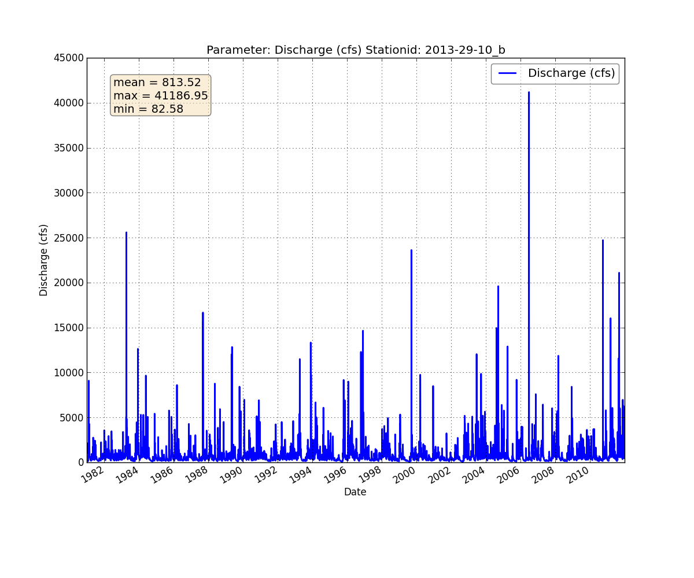
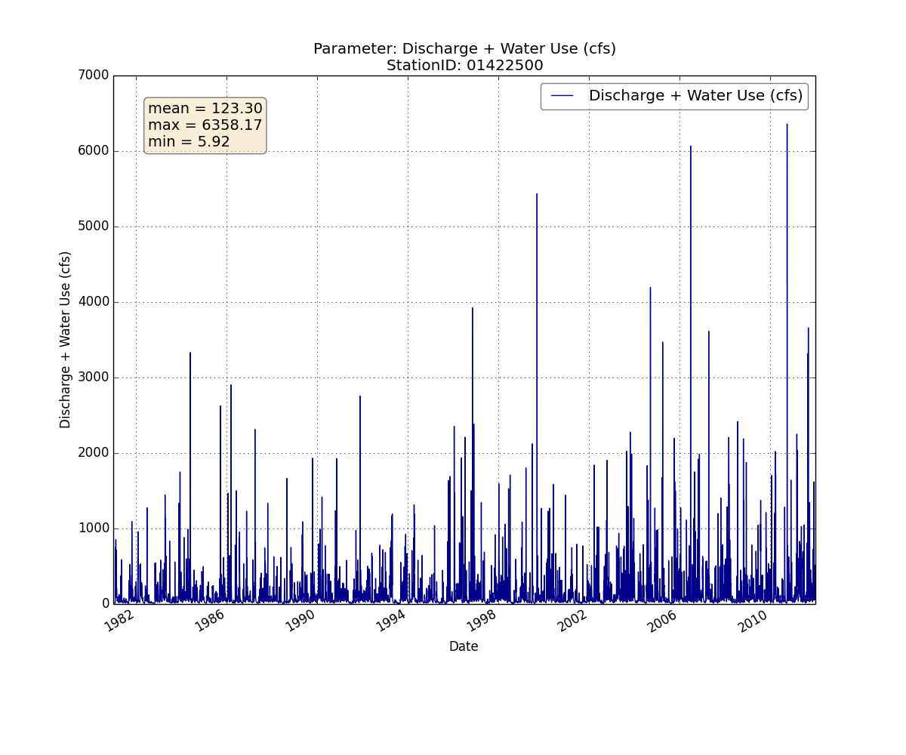
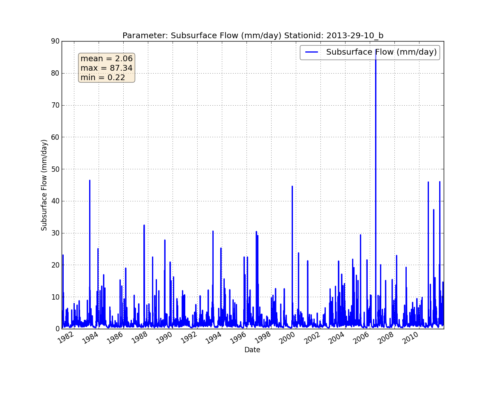
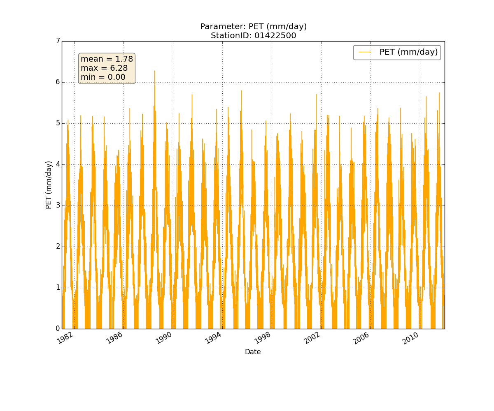
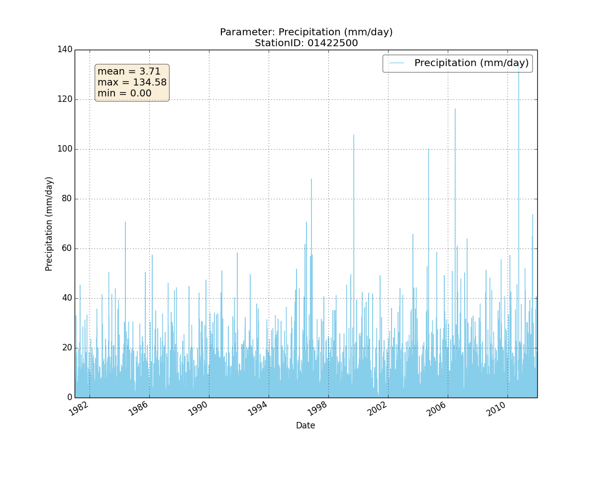
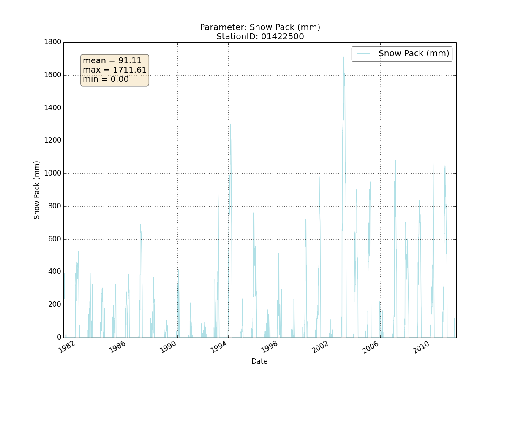
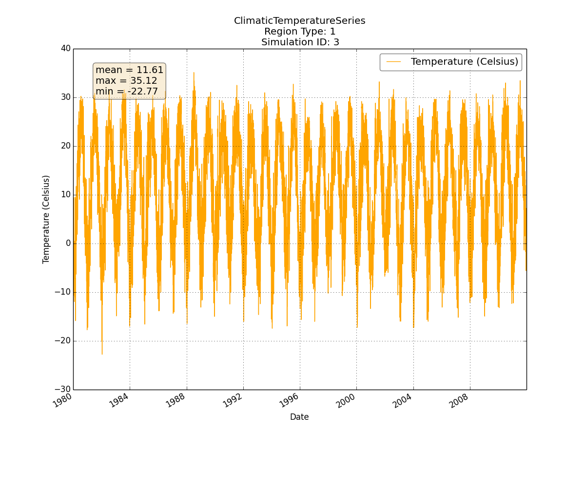
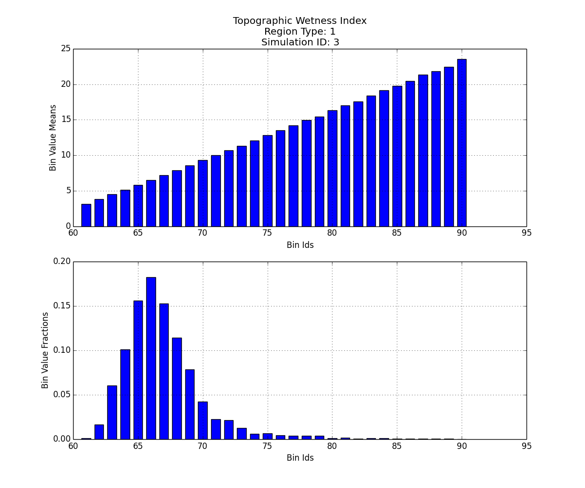
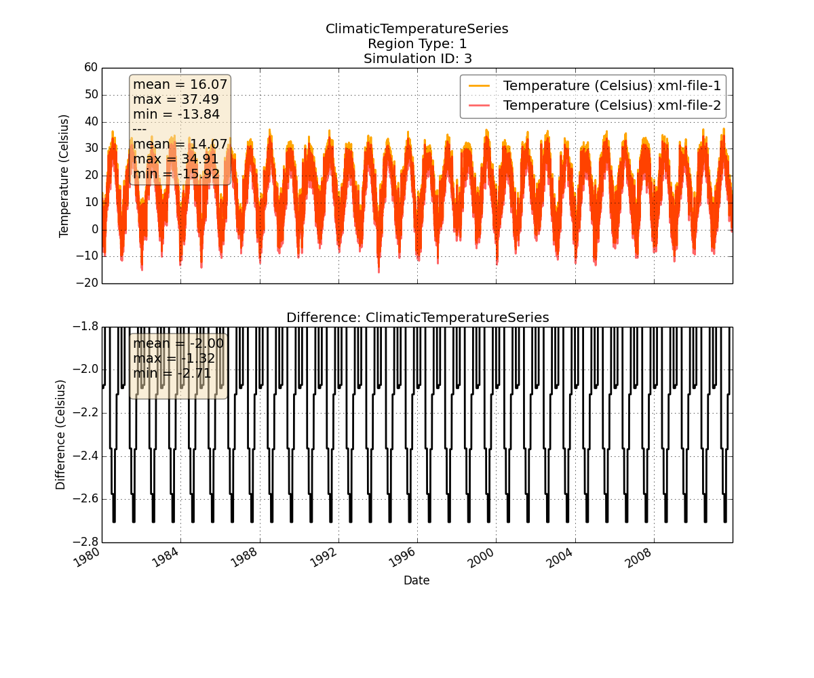
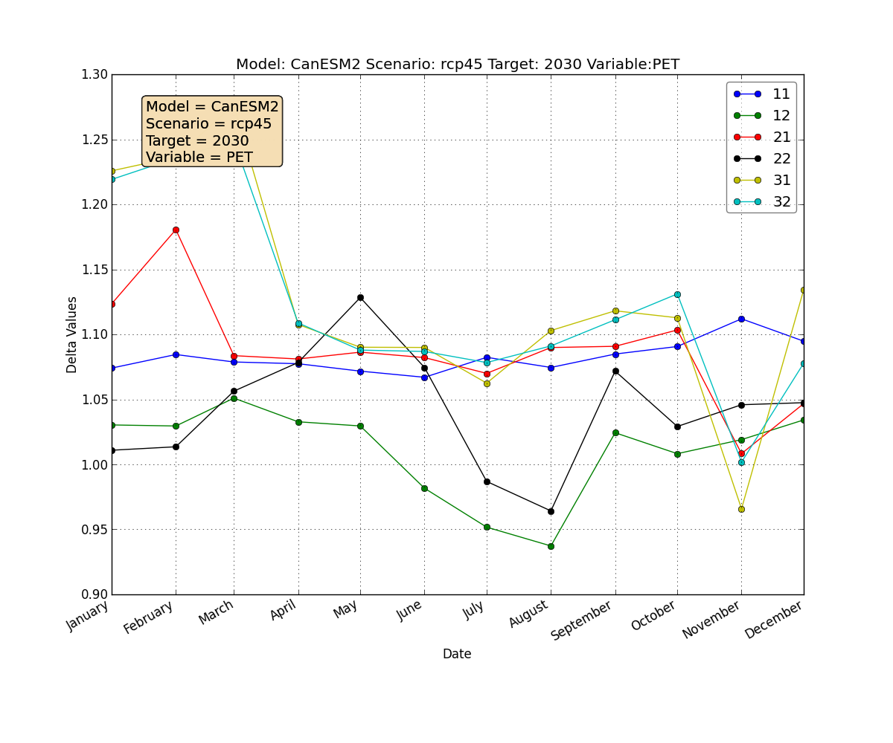

Gallery
=======

Discharge from WATER.txt
------------------------

Water use from WATER.txt
------------------------------

Storage deficit from WATER.txt
------------------------------
.. image:: _static/txt-storage-deficit.png

Subsurface flow from WATER.txt
------------------------------

AET from WATER.txt
------------------
.. image:: _static/txt-aet.png

PET from WATER.txt
------------------

Precipitation from WATER.txt
----------------------------

Snowpack from WATER.txt
-----------------------

Average Soil Root Zones from WATER.txt
--------------------------------------
.. image:: _static/txt-avgsoilrootzone.png

Temperature from WATERSimulation.xml
------------------------------------

TWI from WATERSimulation.xml
----------------------------

Comparison of discharge between 2 WATER.txt files
-------------------------------------------------
.. image:: _static/txt-discharge-cmp.png

Comparison of storage deficit between 2 WATER.txt files
-------------------------------------------------------
.. image:: _static/txt-storage-deficit-cmp.png

Comparison of temperature between 2 WATERSimulation.xml files
-------------------------------------------------------------

Sample Global Climate Model deltas
----------------------------------

Map of samples Global Climate Model deltas
------------------------------------------
.. image:: _static/canes-deltas-map.png

