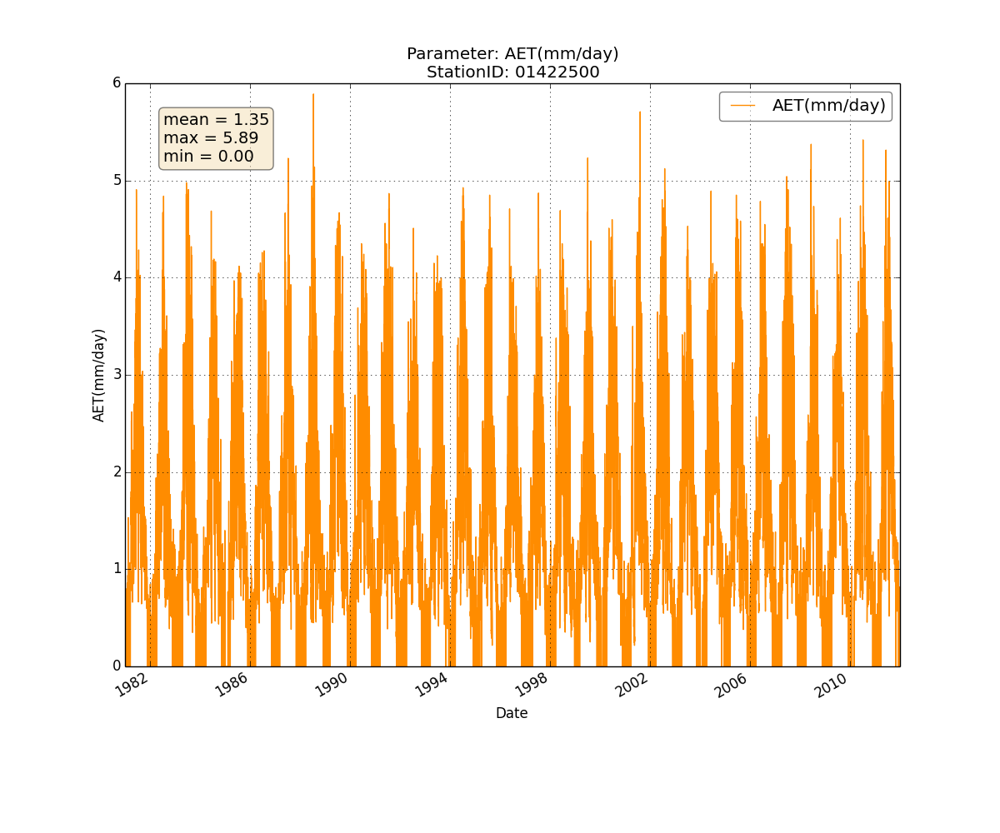
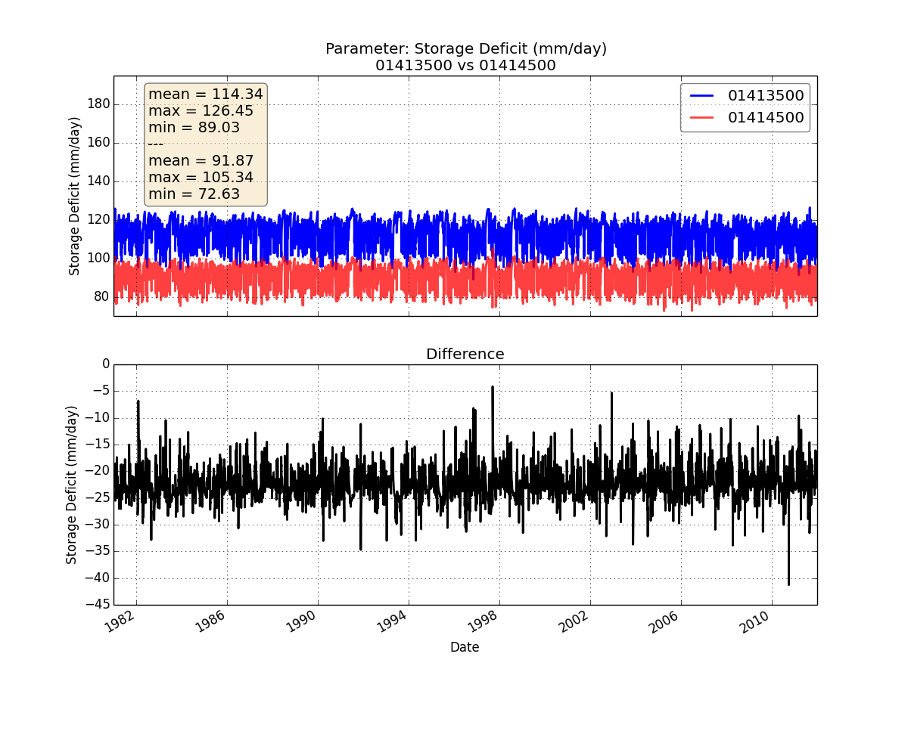

Gallery
=======

Discharge from WATER.txt
------------------------
.. image:: _static/txt-discharge.png

Water use from WATER.txt
------------------------------

Storage deficit from WATER.txt
------------------------------
.. image:: _static/txt-storage-deficit.png

Subsurface flow from WATER.txt
------------------------------
.. image:: _static/txt-subsurface-flow.png

AET from WATER.txt
------------------

PET from WATER.txt
------------------
.. image:: _static/txt-pet.png

Precipitation from WATER.txt
----------------------------
.. image:: _static/txt-precipitation.png

Snowpack from WATER.txt
-----------------------

Average Soil Root Zones from WATER.txt
--------------------------------------
.. image:: _static/txt-avgsoilrootzone.png

Temperature from WATERSimulation.xml
------------------------------------
.. image:: _static/xml-temperature.png

TWI from WATERSimulation.xml
----------------------------

Comparison of discharge between 2 WATER.txt files
-------------------------------------------------
.. image:: _static/txt-discharge-cmp.png

Comparison of storage deficit between 2 WATER.txt files
-------------------------------------------------------

Comparison of temperature between 2 WATERSimulation.xml files
-------------------------------------------------------------
.. image:: _static/xml-delta-temperature.png

Sample Global Climate Model deltas
----------------------------------

Map of samples Global Climate Model deltas
------------------------------------------
.. image:: _static/canes-deltas-map.png

