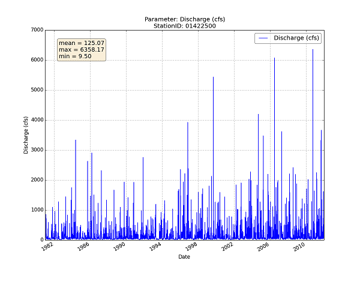

.. waterapputils documentation master file, created by
   sphinx-quickstart on Tue Apr 08 15:39:05 2014.
   You can adapt this file completely to your liking, but it should at least
   contain the root `toctree` directive.

Welcome to waterapputils's documentation!
=========================================

*waterapputils* is a command line tool for analysing, processing, and editing output data files from the
USGS Kentucky Water Science Center WATER application developed by Williamson, T., Ulery, R. and Newson, J., 2012.
WATER is a graphical user interface wrapped around a variant of the rainfall-runoff model called Topmodel 
(Topography based hydrological model) by Keith Beven, Lancaster University. The model estimates river discharge 
and spatial soil water saturation patterns for a particular catchment basin using topographic, climatic, and geological 
input data parameters.

Some sample highlights include:

* Processes WATER output *.txt data files 
* Processes WATER output *.xml data files that store information about a particular model run 
* Creates an edited/updated *.xml data file that WATER can read 
* Generates and saves plots of all parameters found in WATER output *.txt data files
* Generates and saves plots of time-series parameters found in WATER output *.xml data files
* Generates and saves comparison plots between original and editted *.xml data files
* Unix friendly

.. image:: _static/xml-precipitation-small.png
.. image:: _static/xml-temperature-small.png

Some sample highlights include:																		

* Processes USGS NWIS data files
* Generates and saves plots of all parameters found in USGS NWIS data files
* Retrieves and processes NWIS data files using USGS web services
* Logs erroneous data found in NWIS data files 
* Unix friendly

Overview
========

.. toctree::
   :maxdepth: 2
   
   overview.rst

   
Documentation
=============

.. toctree::
   :maxdepth: 2

   code.rst

   
Download
========

https://github.com/jlant-usgs/waterapputils
 
 
Gallery  
=======

.. toctree::
   :maxdepth: 2
   
   gallery.rst

Indices and tables
==================

* :ref:`genindex`
* :ref:`modindex`
* :ref:`search`

